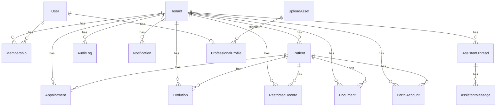

# Banco de Dados

## Tecnologia

- PostgreSQL
- Prisma ORM

Arquivo principal do schema:

- `prisma/schema.prisma`

## Estrategia de modelagem

O sistema e multitenant por escopo logico. Quase todas as entidades centrais possuem `tenantId`, e as consultas do backend sempre devem restringir os dados ao tenant da sessao.

## Enums

### `MembershipRole`

- `OWNER`
- `ADMIN`
- `PROFESSIONAL`
- `RECEPTION`
- `INTERN`
- `READONLY`
- `PATIENT`
- `GUARDIAN`

### `AppointmentStatus`

- `SCHEDULED`
- `CONFIRMED`
- `COMPLETED`
- `NO_SHOW`
- `CANCELED`
- `RESCHEDULED`
- `BLOCKED`

### `AppointmentMode`

- `IN_PERSON`
- `ONLINE`
- `HYBRID`

### `DocumentType`

- `DECLARATION`
- `CERTIFICATE`
- `REPORT`
- `MULTIDISCIPLINARY_REPORT`
- `PSYCHOLOGICAL_EVALUATION`
- `OPINION`

### `RecordSensitivity`

- `NORMAL`
- `HIGH`
- `CRITICAL`

### `SessionFormat`

- `IN_PERSON`
- `ONLINE`
- `HOME_VISIT`
- `GROUP`

### `NotificationType`

- `INTERNAL`
- `SYSTEM`
- `SECURITY`

### `AuditAction`

- `CREATED`
- `UPDATED`
- `DELETED`
- `VIEWED`
- `EXPORTED`
- `SHARED`
- `AUTHENTICATED`
- `PIN_VERIFIED`

## Entidades principais

### `Tenant`

Representa a clinica ou workspace principal.

Campos relevantes:

- identificacao: `id`, `name`, `slug`, `brandingName`
- politica institucional:
  - `recordRetentionYears`
  - `healthDataRetentionYears`
  - `disposalMode`
  - `disposalWindowDays`
  - `requireDocumentShareConsent`

Relacionamentos:

- memberships
- patients
- professionals
- appointments
- evolutions
- restrictedRecords
- documents
- uploadAssets
- portalAccounts
- notifications
- auditLogs
- assistantThreads

### `User`

Representa o usuario interno do sistema.

Campos relevantes:

- `email`
- `passwordHash`
- `firstName`
- `lastName`
- `pinHash`
- `isActive`
- `lastLoginAt`

Relacionamentos:

- memberships
- professional
- assistantMessages

### `Membership`

Tabela de associacao entre `User` e `Tenant`.

Campo central:

- `role`

Restricao importante:

- `@@unique([tenantId, userId])`

### `ProfessionalProfile`

Perfil profissional vinculado ao usuario interno.

Campos relevantes:

- `licenseCode`
- `specialty`
- `city`
- `state`
- `phone`
- `signatureAssetId`

### `Patient`

Entidade central do dominio clinico.

Campos relevantes:

- identificacao: `fullName`, `socialName`, `birthDate`, `cpf`
- contato: `phone`, `email`, `emergencyContact`
- contexto: `guardianName`, `profession`, `educationLevel`
- entrada: `intakeSource`, `arrivalState`, `arrivalNotes`
- clinico: `demandSummary`, `careModality`, `careFrequency`, `preferredFormat`, `treatmentGoals`
- operacao: `status`, `allowPortalAccess`

Restricoes:

- `@@unique([tenantId, cpf])`
- `@@index([tenantId, fullName])`

### `Appointment`

Agenda clinica e administrativa.

Campos relevantes:

- `patientId` opcional, para permitir bloqueios sem paciente
- `title`, `description`
- `startsAt`, `endsAt`
- `status`, `mode`
- `isBlocked`
- `colorToken`
- `location`, `videoUrl`
- `internalNotes`

Indice:

- `@@index([tenantId, startsAt])`

### `Evolution`

Registro de evolucao clinica.

Campos relevantes:

- `patientId`
- `authorUserId`
- `appointmentId`
- `serviceDate`
- `sessionNumber`
- `durationMinutes`
- `format`
- `summary`
- `procedures`
- `observations`

Indice:

- `@@index([tenantId, serviceDate])`

### `RestrictedRecord`

Registro documental reservado.

Campos relevantes:

- `recordDate`
- `category`
- `content`
- `cidCode`
- `instruments`
- `rationale`
- `reservedNotes`
- `attachmentLabel`
- `sensitivity`

Indice:

- `@@index([tenantId, recordDate])`

### `Document`

Documento clinico emitido para paciente.

Campos relevantes:

- `type`
- `requester`
- `purpose`
- `content`
- `validityText`
- `shareWithPortal`
- `requiresReturnInterview`
- `sharedAt`

Indice:

- `@@index([tenantId, type])`

### `UploadAsset`

Metadado de arquivo enviado.

Campos relevantes:

- `purpose`
- `fileName`
- `mimeType`
- `storageKey`
- `storageProvider`
- `fileSizeBytes`

Uso atual:

- assinatura profissional.

### `PortalAccount`

Conta externa do paciente ou responsavel.

Campos relevantes:

- `email`
- `passwordHash`
- `displayName`
- `role`
- `isActive`
- `invitedAt`
- `lastLoginAt`
- `revokedAt`
- `revokedReason`

Restricao:

- `@@unique([tenantId, email])`

### `Notification`

Notificacao interna de sistema.

Campos:

- `type`
- `title`
- `body`
- `readAt`

### `AuditLog`

Trilha de auditoria.

Campos:

- `actorUserId`
- `resourceType`
- `resourceId`
- `action`
- `metadata`
- `createdAt`

Indice:

- `@@index([tenantId, resourceType])`

### `AssistantThread`

Conversa do assistente por tenant.

Campos:

- `title`
- `createdAt`
- `updatedAt`

### `AssistantMessage`

Mensagem em uma thread do assistente.

Campos:

- `threadId`
- `authorUserId`
- `role`
- `content`
- `createdAt`

## Relacoes principais

## Migracoes

Pasta:

- `prisma/migrations`

Migracoes atuais:

- `0001_init`
- `0002_tenant_policy_and_portal_revocation`

Observacao importante:

- o ambiente remoto precisou ser alinhado manualmente com `prisma migrate resolve` porque o schema ja existia antes do historico de migrations estar corretamente registrado;
- o status atual do Prisma foi normalizado, e o banco esta `up to date`.

## Seed

Arquivo:

- `prisma/seed.ts`

O seed cria:

- tenant demo;
- usuario owner;
- usuario recepcao;
- perfil profissional;
- pacientes de exemplo;
- contas do portal;
- agendamentos;
- evolucoes;
- registro restrito;
- documentos;
- notificacoes;
- trilhas basicas de auditoria.

Credenciais importantes do seed:

- area interna:
  - `demo@lumnipsi.app / LumniPsi@123`
  - `recepcao@lumnipsi.app / Recepcao@123`
- portal:
  - `portal.helena@example.com / Portal@123`
- PIN demo:
  - `4321`

## Convencoes de banco

- quase tudo importante tem `createdAt` e `updatedAt`;
- chaves primarias usam `cuid()`;
- deletes em entidades-filho geralmente usam `Cascade`;
- relacoes opcionais de assinatura e autor usam `SetNull` quando necessario;
- acesso deve ser sempre tenant-aware.
